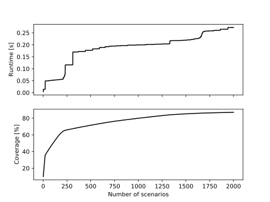

[](https://markov-chain-scenario-trees.readthedocs.io/en/latest/?badge=latest)

# Markov chain scenario trees
Fast optimal pruning for Markov chain scenario tree NMPC.

For the impatient, for whom the  is :

```
$ python example.py
Coverage: 0.10007000774850364 (nominal)
Coverage: 0.40992681716945223 (pruned)
50 scenarios
```




